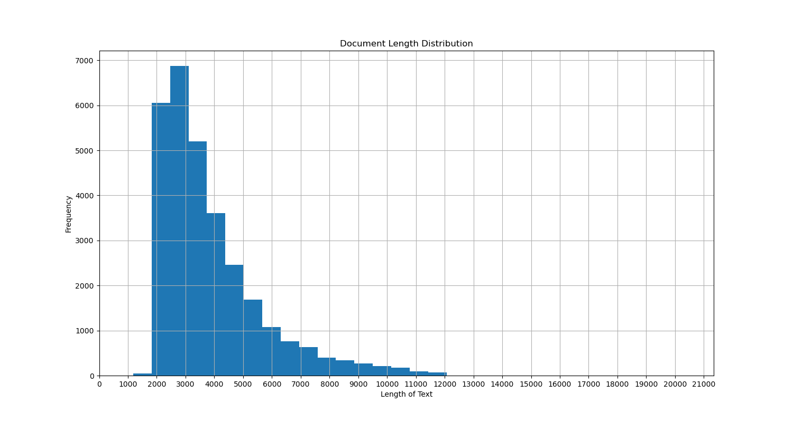
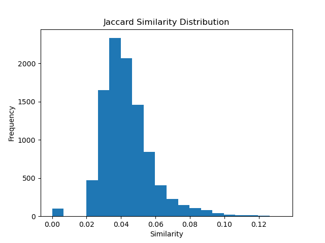
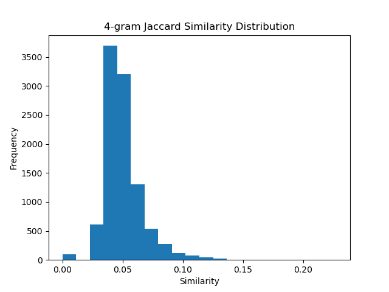
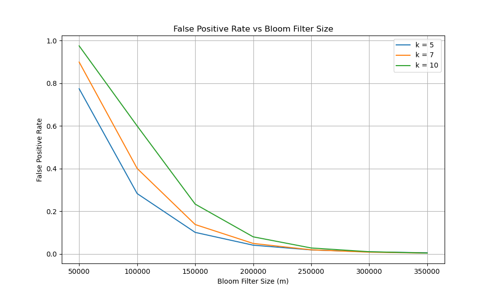
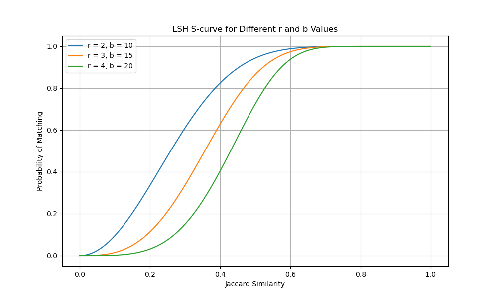

## Exploratory Data Analysis (EDA)

To better understand the characteristics of the dataset and provide insights for parameter selection in **Bloom Filter** and **Locality Sensitive Hashing (LSH)**, we performed the following Exploratory Data Analysis (EDA):

### Document Length Distribution

We analyzed the length of the documents in the dataset and plotted the distribution as shown below:

- Most documents have lengths between **2000 and 5000 characters**, with only a few exceeding **10,000 characters**.
- This distribution suggests that the majority of documents are of moderate length, which can help in determining a suitable size for the bit array in the **Bloom Filter**.

### Document Similarity Analysis

We calculated the **Jaccard similarity** between document pairs using both **3-gram** and **4-gram** shingling, and visualized the distribution of similarities. The results are shown below:

- The majority of document pairs have a similarity score between **0.02 and 0.05**, indicating that most documents are not highly similar to each other.
- Very few document pairs exhibit high similarity, suggesting that the dataset contains diverse content with minimal near-duplicate documents.

### Document Similarity Analysis (3-gram)

To further analyze the similarity between documents, we calculated the **Jaccard similarity** between document pairs using **3-gram** shingling. The distribution of the similarity scores is shown below:

### Key Observations:
- The majority of document pairs have a similarity score between **0.02 and 0.05**, with very few pairs exceeding a similarity of **0.1**.
- This indicates that most documents in the dataset are **not highly similar** to each other, and there are few near-duplicate documents.
- The low similarity scores suggest that **Locality Sensitive Hashing (LSH)** should focus on detecting documents with even small degrees of similarity, which informs our parameter selection for LSH.

### Comparison with 4-gram Results:
- Compared to the **4-gram** analysis, the **3-gram** analysis shows a slight increase in the similarity of document pairs. This is expected, as **3-grams** capture smaller text fragments, increasing the chance of overlap between documents.

### Duplicate Document Detection

We also detected fully duplicate documents within the dataset. A total of **3278 duplicate documents** were found, representing approximately **11%** of the entire dataset. This highlights the need for an effective deduplication strategy in further processing.

## Parameter Selection Insights for Bloom Filter and LSH

Based on the exploratory data analysis (EDA) performed on the dataset, the following insights can be derived to guide the parameter selection for **Bloom Filter** and **Locality Sensitive Hashing (LSH)**:

### Bloom Filter Parameter Selection

The key parameters for the Bloom Filter are:
1. **Bit Array Size (`m`)**: This defines the number of bits in the bit array.
2. **Number of Hash Functions (`k`)**: This defines how many hash functions will be applied to each item.

#### Insights from the Data:
1. **Document Length**: Most documents are between **2000 and 5000 characters**, indicating moderately-sized documents with varied content.
2. **Duplicate Detection**: With **3278 duplicate documents** (~11% of the dataset), the Bloom Filter needs to minimize false positives while handling duplicates.

#### Parameter Recommendations:
- **Bit Array Size (`m`)**: We recommend using a bit array size between **150,000 and 350,000** bits, based on the dataset size and the desired false positive rate.
- **Number of Hash Functions (`k`)**: A value of **7 hash functions** would be optimal, striking a balance between reducing false positives and maintaining computational efficiency.

### LSH Parameter Selection

The key parameters for **Locality Sensitive Hashing (LSH)** are:
1. **Number of Hash Functions per Band (`r`)**: The number of rows per band.
2. **Number of Bands (`b`)**: The number of bands used to hash the document signatures.

#### Insights from the Data:
- The **Jaccard similarity** distribution shows that most document pairs have a low similarity between **0.02 and 0.05**. This suggests that the LSH algorithm needs to be sensitive to low-similarity pairs.

#### Parameter Recommendations:
- **Number of Hash Functions per Band (`r`)**: We recommend a smaller number of rows per band, around **2 or 3**, to capture low-similarity document pairs.
- **Number of Bands (`b`)**: We suggest a larger number of bands, between **15 and 20**, to balance matching precision with the likelihood of finding similar documents.

### Summarized Findings:

#### Bloom Filter:
- **Optimal `m`**: Between **150,000 and 350,000** bits.
- **Optimal `k`**: Around **7 hash functions**.

#### LSH:
- **Optimal `r`**: Between **2 and 3** rows per band.
- **Optimal `b`**: Between **15 and 20** bands.

## Runtime and Memory Usage Analysis for Bloom Filter and LSH

We analyzed and measured the runtime and memory usage for both **Bloom Filter** and **Locality Sensitive Hashing (LSH)** across different dataset sizes (300, 1000, 10,000, and 100,000 documents). The results provide insights into the scalability and efficiency of both methods as the dataset grows.

### Bloom Filter Runtime Analysis

The runtime for both **insertion** and **query** operations was measured for different dataset sizes.

#### Results:

| Dataset Size | Insertion Time (seconds) | Query Time (seconds) |
|--------------|--------------------------|----------------------|
| 300          | 0.0185                   | 0.0180               |
| 1000         | 0.0572                   | 0.0649               |
| 10000        | 0.5805                   | 0.5735               |
| 100000       | --                       | --                   |

#### Key Observations:
- The Bloom Filter exhibits **excellent performance** with small datasets, with both insertion and query times remaining under **1 second** even for datasets up to **10,000 documents**.
- As the dataset size grows, the insertion and query times scale almost **linearly** with the number of documents, showing that Bloom Filter is well-suited for larger datasets.

### LSH Runtime and Memory Usage Analysis

Both runtime and memory usage were measured for **LSH** across different dataset sizes, analyzing **insertion time**, **query time**, and **peak memory usage**.

#### Results:

| Dataset Size | Insertion Time (seconds) | Query Time (seconds) | Peak Memory Usage (MB) |
|--------------|--------------------------|----------------------|------------------------|
| 300          | 5.1114                   | 0.0997               | 59.89 MB               |
| 1000         | 16.6107                  | 1.1519               | 72.11 MB               |
| 10000        | 171.9551                 | 143.0207             | 610.09 MB              |
| 100000       | 521.6969                 | 1498.9935            | 225.19 MB              |

#### Key Observations:
- **Insertion Time**: The insertion time for LSH increases significantly with dataset size, from **5.11 seconds** for 300 documents to over **521 seconds** for 100,000 documents. This suggests that LSH is computationally expensive when scaling to larger datasets.
- **Query Time**: Similar to the insertion time, the query time grows substantially as the dataset increases, reaching **1498.99 seconds** (about **25 minutes**) for 100,000 documents.
- **Memory Usage**: Memory usage for LSH grows with the dataset size, reaching its peak at **610.09 MB** for 10,000 documents but dropping slightly to **225.19 MB** for 100,000 documents. The peak memory usage is not linear, which could be due to the internal optimizations of LSH.

### Comparison of Bloom Filter and LSH

| Dataset Size | Bloom Filter Insertion Time (s) | Bloom Filter Query Time (s) | LSH Insertion Time (s) | LSH Query Time (s) | LSH Peak Memory (MB) |
|--------------|---------------------------------|-----------------------------|------------------------|--------------------|----------------------|
| 300          | 0.0185                          | 0.0180                      | 5.1114                 | 0.0997             | 59.89                |
| 1000         | 0.0572                          | 0.0649                      | 16.6107                | 1.1519             | 72.11                |
| 10000        | 0.5805                          | 0.5735                      | 171.9551               | 143.0207           | 610.09               |
| 100000       | --                              | --                          | 521.6969               | 1498.9935          | 225.19               |

#### Key Insights:
- **Bloom Filter** demonstrates much faster performance than LSH, especially in terms of both insertion and query time. Bloom Filter also scales more gracefully as the dataset size increases, remaining efficient even for **10,000 documents**.
- **LSH**, on the other hand , becomes increasingly computationally expensive as dataset size grows, both in terms of runtime and memory usage. It remains useful for **similarity detection**, but performance optimizations may be necessary when handling larger datasets, particularly those with more than **10,000 documents**.

## Visualizations for Bloom Filter and LSH

In this section, we present visualizations that illustrate how varying parameters affect the **false positive rate for Bloom Filter** and the **S-curve for LSH**. These visualizations help in understanding the relationship between parameter choices and the performance of these techniques.

### Bloom Filter: False Positive Rate vs. Bit Array Size

The following plot shows how the **false positive rate** changes as we vary the **bit array size (`m`)** in the Bloom Filter for different values of the **number of hash functions (`k`)**.

#### Key Insights:
- **Larger bit array sizes (`m`)** significantly reduce the false positive rate, especially beyond **150,000 bits**.
- For a fixed bit array size, increasing the number of hash functions (`k`) from **5 to 7 to 10** reduces the false positive rate. However, diminishing returns are observed after a certain point.

### LSH: S-curve for Different `r` and `b` Values

The S-curve plot below shows how the probability of matching between documents changes based on their **Jaccard similarity** for different combinations of the **number of rows (`r`)** and **bands (`b`)** in **Locality Sensitive Hashing (LSH)**.

#### Key Insights:
- **Smaller `r` values** (fewer rows per band) allow LSH to detect low-similarity pairs of documents, but this comes at the cost of potentially matching dissimilar pairs.
- **Larger `b` values** (more bands) make the LSH algorithm more selective, ensuring that only highly similar documents are matched.
- The parameter combination of **`r = 3` and `b = 15`** offers a good balance between sensitivity and precision, capturing medium-similarity documents without too many false positives.

### Summary of Visualizations

- The **false positive rate for Bloom Filter** is primarily influenced by the **size of the bit array (`m`)** and the **number of hash functions (`k`)**. Larger bit arrays and more hash functions lead to lower false positive rates, but with increasing memory and computational costs.
- The **S-curve for LSH** demonstrates that adjusting the parameters **`r` and `b`** allows fine-tuning of the algorithm's sensitivity to document similarity. By selecting appropriate values of `r` and `b`, LSH can be optimized for different levels of similarity detection, depending on the specific application requirements.

