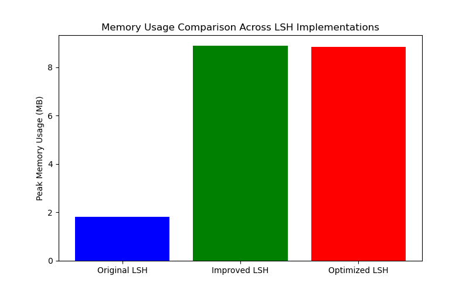

## Exploratory Data Analysis (EDA)

To better understand the characteristics of the dataset and provide insights for parameter selection in **Bloom Filter** and **Locality Sensitive Hashing (LSH)**, we performed the following Exploratory Data Analysis (EDA):

#### Document Length Distribution

We analyzed the length of the documents in the dataset and plotted the distribution as shown below:

- Most documents have lengths between **2000 and 5000 characters**, with only a few exceeding **10,000 characters**.
- This distribution suggests that the majority of documents are of moderate length, which can help in determining a suitable size for the bit array in the **Bloom Filter**.

#### Document Similarity Analysis

We calculated the **Jaccard similarity** between document pairs using both **3-gram** and **4-gram** shingling, and visualized the distribution of similarities. The results are shown below:

- The majority of document pairs have a similarity score between **0.02 and 0.05**, indicating that most documents are not highly similar to each other.
- Very few document pairs exhibit high similarity, suggesting that the dataset contains diverse content with minimal near-duplicate documents.

#### Document Similarity Analysis (3-gram)

To further analyze the similarity between documents, we calculated the **Jaccard similarity** between document pairs using **3-gram** shingling. The distribution of the similarity scores is shown below:

##### Key Observations:
- The majority of document pairs have a similarity score between **0.02 and 0.05**, with very few pairs exceeding a similarity of **0.1**.
- This indicates that most documents in the dataset are **not highly similar** to each other, and there are few near-duplicate documents.
- The low similarity scores suggest that **Locality Sensitive Hashing (LSH)** should focus on detecting documents with even small degrees of similarity, which informs our parameter selection for LSH.

#### Comparison with 4-gram Results:
- Compared to the **4-gram** analysis, the **3-gram** analysis shows a slight increase in the similarity of document pairs. This is expected, as **3-grams** capture smaller text fragments, increasing the chance of overlap between documents.

#### Duplicate Document Detection

We also detected fully duplicate documents within the dataset. A total of **3278 duplicate documents** were found, representing approximately **11%** of the entire dataset. This highlights the need for an effective deduplication strategy in further processing.

## Details of Data Engineering Decisions 

### Preprocessing - Bloom Filter

Typically, a Bloom Filter does not require the same level of preprocessing as algorithms like Locality Sensitive Hashing (LSH). This is because a Bloom Filter is primarily used to check set membership efficiently rather than to compute similarities between items.

### Preprocessing - LSH

1. **Text Normalization**: Converts text to lowercase, removes punctuation, and trims whitespace to ensure uniformity across documents.

2. **Shingling**: Splits each document into shingles (n-grams) of variable length (3, 5, or 7), based on the document’s length. This step captures overlapping content for similarity comparisons.

# Bloom Filter

## Introduction
A Bloom Filter is a probabilistic data structure designed to perform efficient membership checks, allowing us to test whether an element is part of a set. While Bloom Filters can offer a compact and quick way to check for set membership, they come with a small risk of false positives. These trade-offs make Bloom Filters useful in applications where memory efficiency is important and occasional false positives are acceptable.

## How It Works
A Bloom Filter consists of a bit array and several independent hash functions. When adding an element, each hash function maps the element to a position in the bit array, which is then set to 1. To check if an element is present, we apply the same hash functions and check if all corresponding bits are set to 1. If they are, the element might be in the set; if not, we know for certain it’s not.

## Details of Bloom Filter Implementation
Our implementation explores four variations of the Bloom Filter, In this implementation, we used a Bloom Filter with a bit array size of 1,000,000 and 5 hash functions. each with a distinct approach to managing false positives and lookup time.

### Standard Bloom Filter
False Positive Rate: 10.85%
Time Taken for Lookups: 9.87 seconds
The Standard Bloom Filter provides a balance between simplicity and performance, using multiple hash functions to set bits across the bit array. Although it has a moderate false positive rate, it is relatively fast, making it suitable for general use cases where neither extremely low false positives nor the fastest speed is a critical requirement.

### Jurisdictional Bloom Filter
False Positive Rate: 10.87%
Time Taken for Lookups: 10.51 seconds
Analysis: The jurisdictional approach divides the bit array into distinct chunks, restricting each hash function’s values to a specific chunk. This structure resulted in the highest false positive rate among the methods tested. By limiting the hash values to specific segments, there is an increase in overlap within each chunk, reducing the independent space available for each hash value and thus raising the likelihood of false positives. The lookup time, while slower than the optimized method, was faster than universal hashing, due to the additional complexity introduced by chunking.

### Optimized Bloom Filter (Kirsch-Mitzenmacher Optimization)
False Positive Rate: 10.85%
Time Taken for Lookups: 9.13 seconds
Analysis: The Kirsch-Mitzenmacher optimization achieves similar false positive rates to the Standard Bloom Filter by deriving multiple hash values from only two hash functions. This method allows for faster lookups, taking only 9.13 seconds, as it reduces the computational load involved in generating hash values.

Conclusion: The optimized Bloom Filter is ideal for scenarios prioritizing speed without compromising false positive rates. However, it does not significantly reduce the false positives compared to the jurisdictional approach, making it most suitable where lookup speed is crucial.

### Universal Bloom Filter
False Positive Rate: 0.95%
Time Taken for Lookups: 12.32 seconds
Analysis: The Universal Bloom Filter demonstrates a significant reduction in the false positive rate, achieving a rate as low as 0.95%. This method uses random primes and seeds to generate hash values, providing better distribution and reducing overlaps in the bit array. The improved accuracy, however, comes at the cost of lookup speed, with the Universal Bloom Filter taking the longest time at 12.32 seconds. The added complexity in generating hash values slows down the lookups.

Conclusion: Universal hashing is highly effective for applications where minimizing false positives is essential, even if lookup speed is sacrificed. It offers the best trade-off for accuracy-critical tasks but is less suited to scenarios where time efficiency is necessary.

# LSH Filter

## Introduction 

Locality Sensitive Hashing (LSH) is a method for efficiently finding similar items in large, high-dimensional datasets. It’s particularly useful for near-duplicate detection, as it reduces computational complexity by grouping similar items into the same hash "buckets." Unlike traditional hashing, LSH is designed to maximize the chance that similar items have similar hash values, allowing quick, approximate nearest-neighbor searches without exhaustive comparisons.

## How it works
Locality Sensitive Hashing (LSH) is a method for efficiently finding similar items in large, high-dimensional datasets. It’s particularly useful for near-duplicate detection, as it reduces computational complexity by grouping similar items into the same hash "buckets." Unlike traditional hashing, LSH is designed to maximize the chance that similar items have similar hash values, allowing quick, approximate nearest-neighbor searches without exhaustive comparisons.

#### Details of LSH Implementation 

##### Regular Version
- The baseline LSH implementation utilized MinHashing to generate signatures for documents and applied the banding technique to identify candidate pairs likely to be duplicates. Union-Find was employed to cluster these candidates.

##### Improvements Explored
1. **Multi-Probe LSH**:
   - This improvement involved probing multiple similar hash values to increase recall when identifying candidate pairs. The impact on performance was analyzed through experiments.

2. **Adaptive Shingle Size**:
   - We experimented with adjusting the shingle size based on document length, which improved the accuracy of similarity detection for both short and long documents.

3. **Parallel Processing**:
   - For the optimized version, we implemented parallel processing using `ThreadPoolExecutor`, significantly improving the speed of the MinHash and LSH computations.

#### Testing 

This script tests three LSH implementations (**Original**, **Improved**, and **Optimized**) for finding near-duplicate documents, measuring performance and memory usage. For each implementation, it runs the function lsh_near_duplicates_from_files, tracks runtime and peak memory, and writes results to a performance.txt file. It also saves clusters (groups of similar documents) to separate text files for each implementation. Finally, it prints a summary to the console, allowing for easy comparison of the implementations' efficiency.

## Performance And Results

### Bloom Filter - Overall Analysis 

| Bloom Filter Type                          | False Positive Rate | Lookup Time (seconds) |
|--------------------------------------------|----------------------|------------------------|
| Standard Bloom Filter                      | 10.85%              | 9.87                  |
| Jurisdictional Bloom Filter                | 10.87%              | 10.51                 |
| Optimized Bloom Filter (Kirsch-Mitzenmacher) | 10.85%              | 9.13                  |
| Universal Bloom Filter                     | 0.95%               | 12.32                 |

-Viz

### LSH - Overall Analysis

| Implementation   | Size | Runtime (seconds) | Peak Memory Usage (MB) | Average Jaccard Similarity |
|------------------|------|-------------------|-------------------------|----------------------------|
| Original LSH     | 100  | 82.74            | 1.82                    | 0.77                       |
| Improved LSH     | 100  | 72.30            | 8.88                    | 0.63                       |
| Optimized LSH    | 100  | 70.40            | 8.84                    | 0.94                       |

In terms of the visualisations, which showcase the same info

We can see that the Optimised LSH performs the best and has higher Average Jaccard Similarity.

## Challenges Enountered 

### Bloom Filter 

Developing this Bloom Filter package brought valuable lessons in efficient data structure design and memory management. One key challenge was fine-tuning the hashing methods to balance speed and accuracy across large datasets. Experimenting with various hashing approaches highlighted the trade-offs between computational cost and collision reduction.
Conclusion: Jurisdictional hashing, while an innovative approach, does not significantly improve false positives and adds complexity to the lookups. It may not be suitable for applications requiring low false positives, as it increases the probability of overlap.

### LSH 

Using Locality Sensitive Hashing (LSH) for near-duplicate detection involves balancing speed, accuracy, and memory usage. Key challenges include tuning parameters like hash functions, bands, and rows to reduce false positives and negatives while managing memory-intensive hash buckets and minhash signatures. Choosing the optimal shingle size is also critical, as it affects similarity detection. Additionally, balancing accuracy with performance remains complex, as LSH’s approximation can lead to missed duplicates or unrelated documents being grouped together. But we see that the the optimised version of the LSH performs the best.

